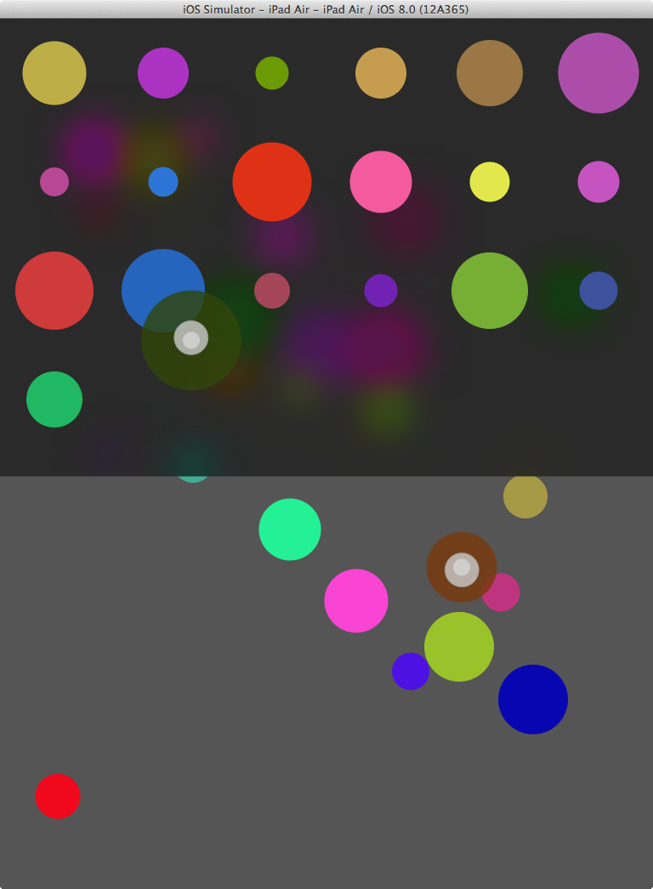

TouchDemo
=========

This is replica of that cute little demo from [WWDC 2014](https://developer.apple.com/videos/wwdc/2014/) Session 235 - Advanced Scrollviews and Touch Handling Techniques:

> Scrollviews build on gesture recognizers and underlying multi-touch mechanics to provide a fundamental piece of the iOS user experience. Gain a broader understanding of the iOS touch handling architecture through practical real-world examples. Discover advanced tips and tricks for combining scrolling with other touch handling techniques to create delightful user interfaces.

Apple didn't provide sample code for this one, so I've created it in [Swift](https://developer.apple.com/swift/).

`done for fun`
